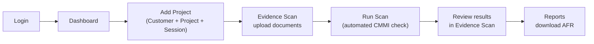

# CMMI V3.0 Audit Platform — High-Level Design

## 1. What this application does

The CMMI V3.0 Audit Platform lets a CMMI appraisal team:

1. Register a **customer**, a **project**, and an **audit session**.
2. **Upload evidence documents** (policies, logs, registers, reports — Word/Excel/PDF/PPT/images/ZIPs).
3. Run an **automated scan** that checks the evidence against ~300 CMMI rules and reports gaps.
4. Review the resulting **findings**, discuss them, and track **remediation**.
5. Generate a formal **Audit Findings Report (AFR)** for sign-off.

Everything above runs as **one Python web application** — there is no separate frontend project anymore. An older React frontend (`cmmi-audit/`) existed at one point but has been retired; all screens today are built with **NiceGUI**, a Python framework that renders a full web UI (menus, forms, tables, dialogs) directly from Python code.

---

## 2. Technology stack (overview only)

| Layer | What it is | Notes |
|---|---|---|
| **Frontend** | NiceGUI (Python) rendering a Quasar/Vue web UI in the browser | No separate JS/React build. Every screen (login, dashboard, forms, tables) is written as Python code under `app/gui/`. The browser just displays what NiceGUI sends it and talks back over a WebSocket. |
| **Backend** | FastAPI (Python), with a service layer underneath | One backend process handles both the web pages and a REST API (`/api/v1/...`). Business logic — scanning evidence, classifying documents, generating reports — lives in plain Python service modules, not scattered across the UI. |
| **Database** | MySQL | Stores all structured data: customers, projects, audit sessions, evidence metadata, findings, users/roles, reports history. Actual uploaded files (documents) are **not** stored in the database — only their metadata and file path; the files themselves sit on disk. |
| **Deployment** | Docker (available), currently run locally for testing | A `Dockerfile` + `docker-compose.yml` exist for a containerized app + MySQL setup, but at this stage the project is being **run and tested locally** on a developer machine rather than deployed anywhere. See §3. |

That's the full technical picture at a glance — the rest of this document focuses on **what the application actually does, screen by screen**, since that's the part that matters day to day.

---

## 3. Running it locally (current testing setup)

Right now the app is only run locally for development/testing — nothing is deployed externally yet. The local setup is:

1. **Prerequisites**: Python 3.12 installed, and a MySQL server running locally (or reachable) with a database created for the app.
2. **Configure environment**: copy `.env.example` to `.env` and fill in local values (DB host/user/password/name, a secret key, upload/output folders, etc.).
3. **Install & run**:
   ```powershell
   python -m venv .venv
   .\.venv\Scripts\Activate.ps1
   pip install -r requirements.txt
   python main.py
   ```
4. Open the browser at `http://localhost:8090` — this hits the same process that serves both the UI pages and the API.
5. On first startup, the app automatically creates all database tables and seeds the base data (roles, CMMI practice areas, and the initial rule checklist). On an empty database, `/login` presents a one-time first-administrator registration form. Once any account exists, public registration is permanently unavailable and administrators create subsequent accounts through Manage Users.
6. Tests: `pytest -q` runs the automated test suite (uses a throwaway SQLite database, so it doesn't touch your local MySQL data).

A containerized path (`docker compose up -d --build`, app + MySQL as two services) is already prepared for when this moves beyond local testing, but is not the current day-to-day workflow.

---

## 4. Roles & who can see what

Access is controlled by database-backed **role → screen permission** mappings. The supported default roles are **Admin, Super Admin, Auditor, and Auditee**. Admin and Super Admin initially have full access, including Rules Catalogue. Administrators can create new roles and grant each active page View or View-and-manage access without a code change; new roles begin with no page access. A user only sees menu entries their roles can open.

---

## 5. Navigation — the left sidebar

Every authenticated page shares the same left sidebar. It only lists the screens your role can open — an Auditor never sees "Rule Catalog", "Manage Users", or "Manage Roles" in their menu at all, they aren't just blocked after clicking. The sidebar can be collapsed to icons-only (a toggle button remembers your preference across visits) and turns into a slide-out drawer on narrow/mobile screens. The current page is highlighted. At the bottom, your name/role sits next to a menu with **Profile** (shows your name, email, role) and **Logout** (ends the session and returns you to `/login`).

The rest of this section walks through every page **section by section** — what's on screen, what each button does, what has to happen before it becomes usable, and where the result of clicking it shows up.

---

### 🔐 Login — `/login`

A single card: **Email** field, **Password** field, **Sign in** button. Clicking Sign in sends the credentials to the server; on success the browser is redirected straight to your role's landing page (Dashboard, for most roles); on failure a notification shows the reason (e.g. wrong password, account locked). If Microsoft sign-in is turned on for the deployment, a second button appears — it currently only shows an informational message, since that login path isn't wired up to a real Microsoft account yet.

---

### 🏠 Dashboard — `/` (default landing page)

**Current audit workspace card** — shows which customer/project/audit session you're currently looking at (or "Loading..." the very first time). A **Change audit session** button opens a dialog with a dropdown of every saved audit session in the system; picking one and clicking **Use this audit session** switches the whole dashboard — and everything remembered for Evidence Scan too — to that session.

**Metric row** — five number tiles calculated live from the database for the selected session: total Audit Projects in the system, the Selected Session's ID, how many Evidence Files are stored for it, how many Open Findings it has, and how many AFR reports have been generated for it.

**Action buttons:**
- **Open Add Project** → jumps to the Add Project page.
- **Review findings** → jumps to the Findings page.
- **Run 302-rule audit scan** → runs the full evidence scan for the *currently selected* session right from the dashboard (same engine as the Evidence Scan page's button); on completion it shows how many findings came out of how many files and refreshes everything below.
- **Generate AFR (Excel)** → generates an Excel Audit Findings Report for the selected session immediately, scoped to whatever practice areas are currently in view; a notification tells you the report number was created and to open the **Reports** page to download it.
Each of these is disabled with a permission warning if your role isn't allowed to run scans or generate reports.

**Practice-area coverage card** — a circular percentage gauge (`Available ÷ total practice areas`) next to a breakdown of how many of the 35 CMMI practice areas are Available, in Gap, Missing, or Not scanned yet for this session.

**Audit findings card** — a simple count of open findings broken down by severity (Critical / Major / Minor), each as a colored badge.

**Domain-wise coverage table** — the same coverage numbers as above, but grouped into 8 broader CMMI domains (e.g. Development, Services, Security, Data) instead of raw practice-area codes, with a per-domain score percentage — useful for a "big picture" view before drilling into individual practice areas.

**Practice-area detail** — one expandable row per practice area, each showing its status badge (Available/Gap/Missing/Not scanned), which domain it belongs to, and how many findings it has. Opening one with findings shows a small table of them, and — if your role can manage findings — a **Manage #ID** button per finding that opens a dialog where you can:
  - read every existing **comment** on that finding and add a new one,
  - read every existing **remediation action** (with its status badge — open/completed/cancelled) and add a new one with an optional due date.
Both are saved immediately and the dashboard refreshes to reflect them.

---

### ➕ Add Project — `/add-project`

**Header row** — page title plus a single **Add Project** button that opens the setup dialog. There is no multi-step wizard; one form does everything.

**Add Project dialog** — fields: Customer name*, Customer contact email, Project name*, Repository URL, Audit session name*, Audit date (calendar picker), Auditors (comma-separated names), Auditees (comma-separated names). Clicking **Save project details**:
1. Looks for an existing customer with that name (case-insensitive) — reuses it if found, otherwise creates it.
2. Does the same for the project, scoped to that customer.
3. Does the same for the audit session, scoped to that project and matched on name **and** date — if an identical one already exists it's reused (so re-submitting the same form twice never creates duplicates); a brand-new session is automatically pinned to whichever CMMI ruleset is currently active and gets tracking rows seeded for all 35 practice areas.
4. Notifies you whether the audit session was *created* or *reused*, and remembers this customer/project/session as your "current workspace" so Dashboard and Evidence Scan open on it automatically next.

**Saved details table** — every customer/project/session combination ever created, with columns for Customer, Project, Repository, Audit session, Audit date, Auditors, Auditees, the pinned Ruleset ID, and when it was added. Each row has:
  - an **edit (pencil)** action — opens the same form pre-filled so you can correct a name/date/contact without losing the session's scan history, with the same duplicate-name checks applied;
  - a **delete (trash)** action — opens a confirmation warning that deletion is **blocked automatically** if that session already has any uploaded evidence, scan runs, findings, approvals, reports, or incident-validation data, so audit history can't be accidentally destroyed. If it's genuinely empty, deleting it also cleans up the parent project/customer if they have no other sessions left.

---

### 📁 Evidence Scan — `/evidence-scan`

The page uses three guided tabs:

1. **Workspace** — select the saved customer, project, and audit session. Upload and scan tabs stay unavailable until this selection is valid.
2. **Upload evidence** — add an individual supported file or one project ZIP. ZIP contents are stored as individual evidence files in the selected session.
3. **Scan and results** — run the scoped scan and review saved documents, file-backed findings, review-only coverage gaps, downloads, and scan history for that selected session.
---

### 📄 Reports — `/reports`

- **Generated reports table** lists every AFR produced across all sessions — Report ID, Project Name, Audit Session, Generated timestamp, and a **Download** link that fetches the actual file from the server.
- **Search** filters the visible reports by Report ID, Project Name, Audit Session, or generated date/time.

*(The Evidence Scan page provides CSV/Excel exports for the selected audit session.)*

---

### 📚 Rule Catalog — `/rule-catalog`

Two tabs:

**Manage versions**
- Review the active workbook and version history, validate a replacement `.xlsx` workbook, then explicitly activate a validated version.
- Update keys, aliases, and expected-evidence wording only for one of the fixed 14 approved document types; document types and practice-area mappings cannot be changed.

**Browse stored rules**
- Select an active or historical ruleset, then search the stored database rules without changing an audit session.
---

### 👥 Manage Users — `/users`

- **Users table** — every account's Email, Display name, Roles, and Active status.
- **Create/edit user form** — Email, Display name, Temporary password (12+ characters required), and a database-backed Role dropdown. There is **no self-service sign-up page anywhere in the app**.
- **Lifecycle** — accounts are activated or deactivated rather than removed from audit history. Deactivation revokes active sessions and cannot lock out the final Manage Users administrator.

### 🛡️ Manage Roles — `/roles`

- **Role editor** — create roles, update role names/descriptions, and select a readable default landing page.
- **Screen access matrix** — grant Read or Write for every active application screen. Write always implies Read and the complete matrix is saved atomically.
- **Safety** — role/screen grants use stable IDs, new roles begin with no access, and the final active administrator for either management page cannot be removed.

---

## 6. A typical end-to-end flow



Login → set up the audit → upload evidence → scan it → review findings in Evidence Scan → download the required report. The **Rule Catalog**, **Manage Users**, and **Manage Roles** screens sit off to the side as admin-only setup/maintenance, not part of the day-to-day auditor flow.

---

## 7. A note on the technical layering (for context, not detail)

Two things are worth knowing without digging into code:

- The web pages and the REST API (`/api/v1/...`) run in the **same process** and share the same login session — so when you click a button on a page like "Run Scan" or "Generate Report," it's calling the same backend logic that the API exposes, just without always going through a formal HTTP call.
- All uploaded evidence files are stored on disk (not in the database); the database only tracks *what* was uploaded, *where* it lives, and the result of scanning it. This keeps the database itself lightweight even with large audit evidence sets.

For a deeper, code-level version of this design (module names, data model fields, the internal scan pipeline steps, security mechanisms) — see the fuller reference this document was distilled from, or ask for it again in that level of detail.
